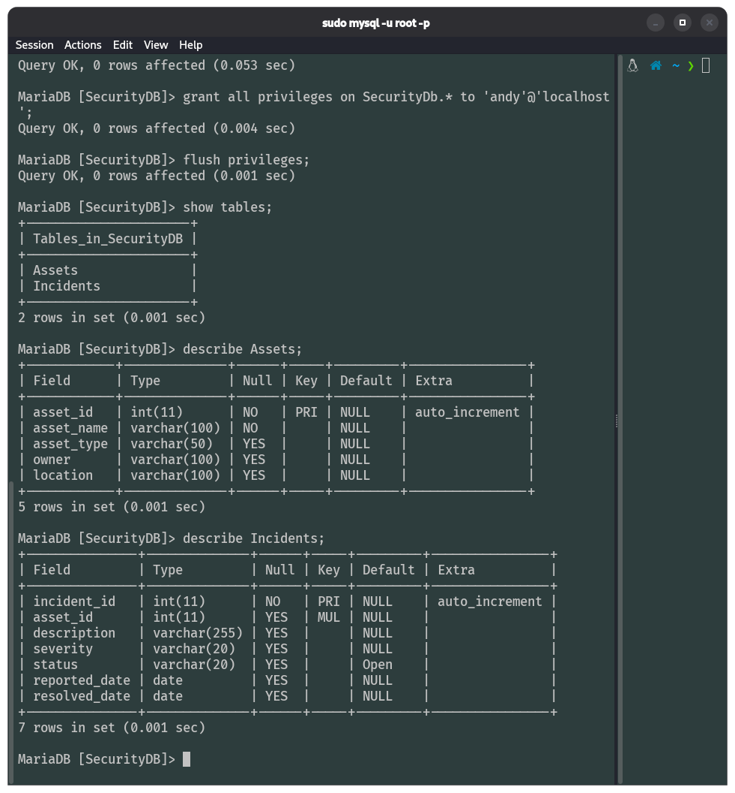
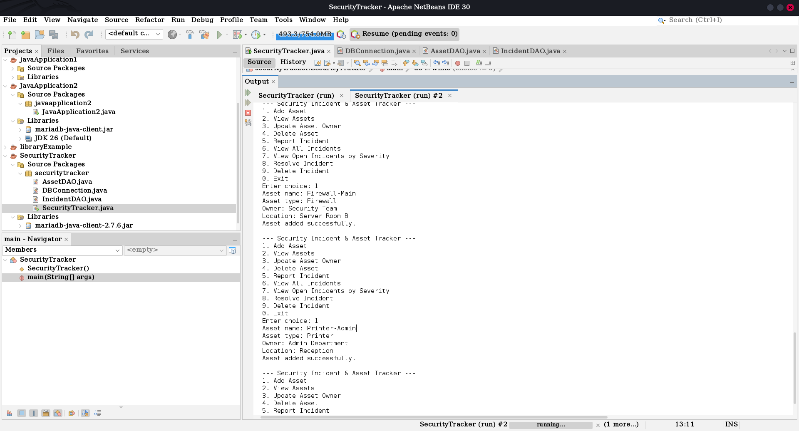
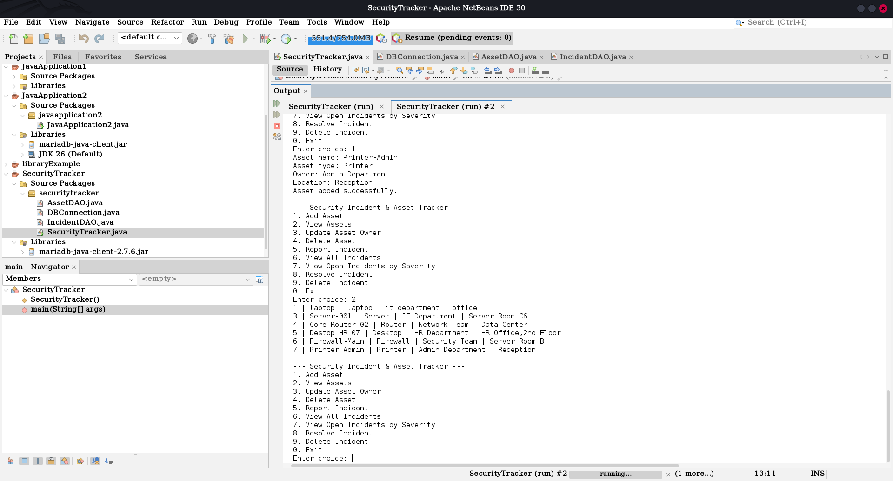
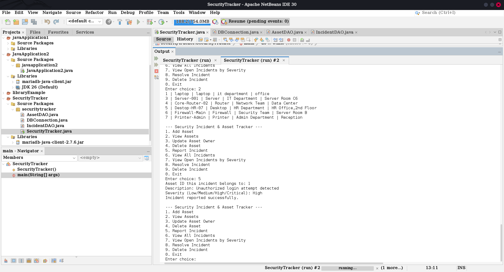
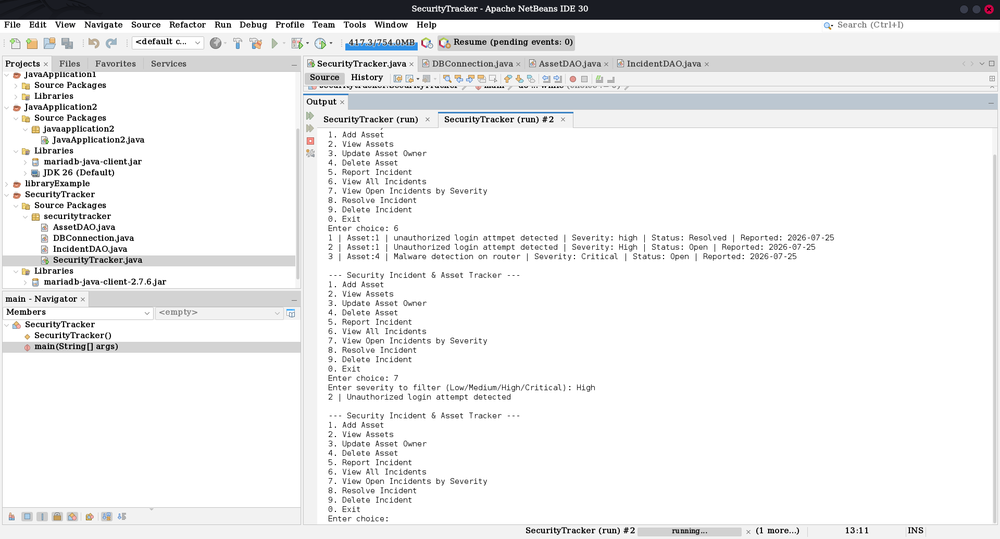
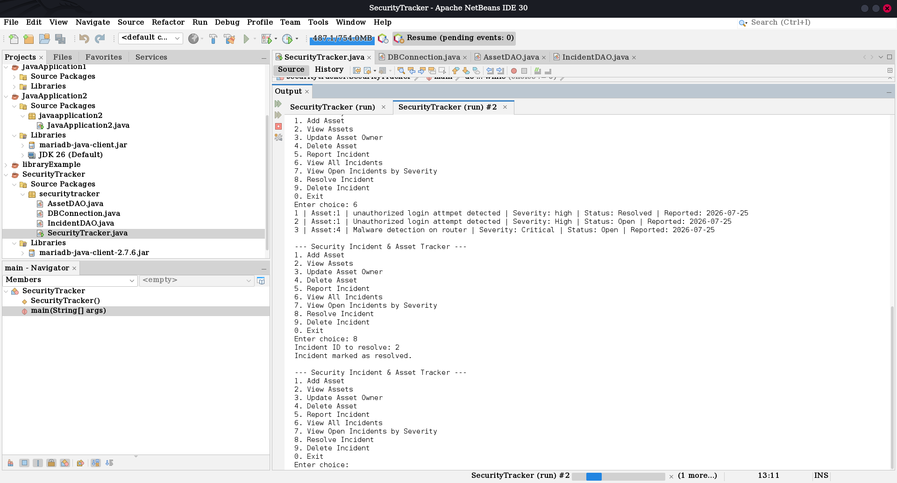
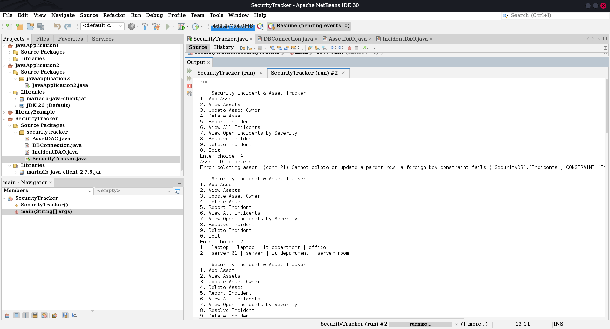

<div align="center">

#  Security Incident & Asset Tracker

**A console-based IT Asset & Security Incident Management System**
built with Java, JDBC, and MariaDB — modeled on real-world SOC asset and incident workflows.


</div>

---

##  Overview

Organizations depend on large fleets of IT assets — laptops, servers, routers, firewalls — that require continuous monitoring to stay secure. When a security incident occurs, it needs to be **logged, classified, and resolved efficiently**.

This project is a lightweight, database-backed system that lets a security team:
- Maintain an **asset inventory**
- Log **incidents** against those assets
- Classify incidents by **severity**
- Track **resolution status**

— the same core workflow real SOC teams use to maintain visibility over their infrastructure.

Built as part of J2EE/JDBC coursework, with a deliberate focus on a **cybersecurity-relevant problem domain**, since I'm working toward a SOC Analyst (L1) role. Most academic JDBC projects default to generic library or student-management systems — this one directly reflects the domain I'm building a career in.

---

##  Key Features

| Feature | Description |
|---|---|
|  Asset Management | Add, view, update, and delete IT assets |
|  Incident Reporting | Log new security incidents linked to specific assets |
|  Severity Classification | Low / Medium / High / Critical |
|  Status Tracking | Open / Resolved, with resolution date tracking |
|  Filtered Views | View only Open incidents by severity — surface what's urgent first |
|  Secure Queries | All database operations use `PreparedStatement` to prevent SQL injection |
|  Referential Integrity | Foreign key constraints protect linked asset/incident records |

---

##  Skills Demonstrated

This project was built to show practical, job-relevant ability — not just syntax knowledge:

- **Secure coding practice** — parameterized queries throughout, closing off the most common SQL injection vector by design, not as an afterthought
- **Relational schema design** — two normalized tables linked via foreign key, with sensible defaults (`status = 'Open'`) and constraints
- **DAO design pattern** — clean separation between data access logic and application logic, making the codebase maintainable and testable
- **Domain-driven thinking** — chose a security-operations problem over a generic CRUD template, reflecting the SOC Analyst career path this project supports

---

##  Tools & Technologies

<div align="center">


</div>

| Category | Tool / Technology |
|---|---|
| Language | Java (JDK 17+) |
| Database | MariaDB |
| Database Connectivity | JDBC — MariaDB Connector/J |
| IDE | Apache NetBeans |
| Operating System | Kali Linux |
| Version Control | Git & GitHub |
| Design Pattern | DAO (Data Access Object) |

---

##  Database Schema

The database (`SecurityDB`) consists of two related tables, linked via a foreign key:

**Assets**

| Field | Type | Key |
|---|---|---|
| asset_id | INT (Auto Increment) | Primary Key |
| asset_name | VARCHAR(100) | |
| asset_type | VARCHAR(50) | |
| owner | VARCHAR(100) | |
| location | VARCHAR(100) | |

**Incidents**

| Field | Type | Key |
|---|---|---|
| incident_id | INT (Auto Increment) | Primary Key |
| asset_id | INT | Foreign Key → Assets |
| description | VARCHAR(255) | |
| severity | VARCHAR(20) | |
| status | VARCHAR(20) | Default: `'Open'` |
| reported_date | DATE | |
| resolved_date | DATE | |

 Full definition: [`schema.sql`](./schema.sql)

---

##  Project Structure

```text
security-incident-asset-tracker/
├── docs/
│   ├── Project_Proposal.pdf
│   └── screenshots/
│       ├── database-schema.png
│       ├── add-asset.png
│       ├── view-assets.png
│       ├── report-incident.png
│       ├── filter-severity.png
│       ├── resolve-incident.png
│       ├── view-incident-resolved.png
│       └── foreign-key-constraint.png
├── DBConnection.java
├── AssetDAO.java
├── IncidentDAO.java
├── SecurityTracker.java
├── schema.sql
├── LICENSE
└── README.md
```

---

##  Screenshots

<details>
<summary><b>Database Setup</b> — click to expand</summary>
<br>



</details>

<details open>
<summary><b>Application in Action</b></summary>
<br>

| Adding an Asset | Viewing Assets |
|---|---|
|  |  |

| Reporting an Incident | Filtering by Severity |
|---|---|
|  |  |

| Resolving an Incident | Foreign Key Integrity |
|---|---|
|  |  |

</details>

---

##  How to Run

**1. Set up the database**
```bash
mysql -u root -p < schema.sql
```

**2. Configure credentials**

Update the database URL, username, and password in `DBConnection.java` to match your local MariaDB setup.

**3. Compile and run**
```bash
javac *.java
java -cp .:/path/to/mariadb-java-client.jar SecurityTracker
```

**4. Use the console menu**
```
--- Security Incident & Asset Tracker ---
1. Add Asset
2. View Assets
3. Update Asset Owner
4. Delete Asset
5. Report Incident
6. View All Incidents
7. View Open Incidents by Severity
8. Resolve Incident
9. Delete Incident
0. Exit
```

---

##  Why This Project

Most academic JDBC projects default to generic problems like library or student management systems. I chose to build something that directly reflects the domain I'm working toward — security operations — so it doubles as both coursework and a genuine portfolio piece relevant to SOC Analyst roles.

---

##  Author

**Andrew Vinston D'Souza (Andyy)**
BCA Final Year — St. Aloysius (Deemed to be University), Mangaluru
Aspiring SOC Analyst (L1) | Threat Detection & Incident Response

[](https://linkedin.com/in/andrew-vinston-d-souza-41699330a)
[](https://github.com/andyydz)
[](https://tryhackme.com/p/andyydz57)

---

##  License

This project is licensed under the MIT License — see the [LICENSE](./LICENSE) file for details.
